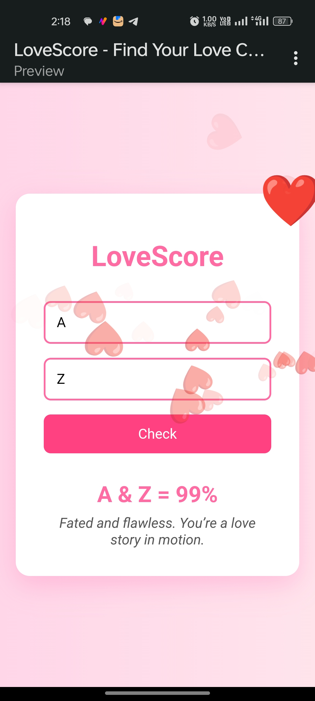

# LoveScore

[](LICENSE)


**LoveScore** is a cute and quirky web app that calculates love compatibility between two people based on their names. Just type, click, and find out your love fate — with hearts, animations, and a message to match!



---

## Features

- Romantic UI with floating hearts and soft gradients
- Instant love compatibility score from 0% to 100%
- Personalized love messages based on the score
- **Same input always returns the same score**
- Mobile-friendly and responsive
- 100% frontend — no backend, no data collection

---

## Demo

**Try it live:** [https://lovescore.glitch.me](https://lovescore.glitch.me)

---

## How It Works

LoveScore uses a **simple hashing algorithm** to generate consistent scores from any pair of names:

1. Names are trimmed, lowercased, and sorted alphabetically.
2. A basic hash function processes the combined string.
3. The result is mapped to a score between 0–100 using modulo.
4. Each score corresponds to a hand-crafted love message.

```js
const combined = [name1, name2].sort().join('');
const score = simpleHash(combined) % 101;
```

So the same names always return the same result — magical and consistent!

---

## Tech Stack

- HTML5
- CSS3 (with animations)
- Vanilla JavaScript

---

## Getting Started

Clone and open locally:

```bash
git clone https://github.com/LakhindarPal/lovescore.git
cd lovescore
```

Then open `index.html` in your browser. That’s it!

---

## Contributing

Got ideas to spice things up? Contributions are welcome!

1. Fork the repo
2. Create a new branch
3. Commit your changes
4. Submit a pull request

---

> Made with ❤️ for the curious, the romantic, and everyone in between.
